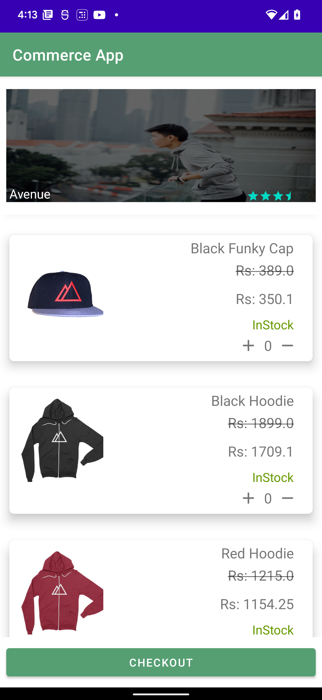
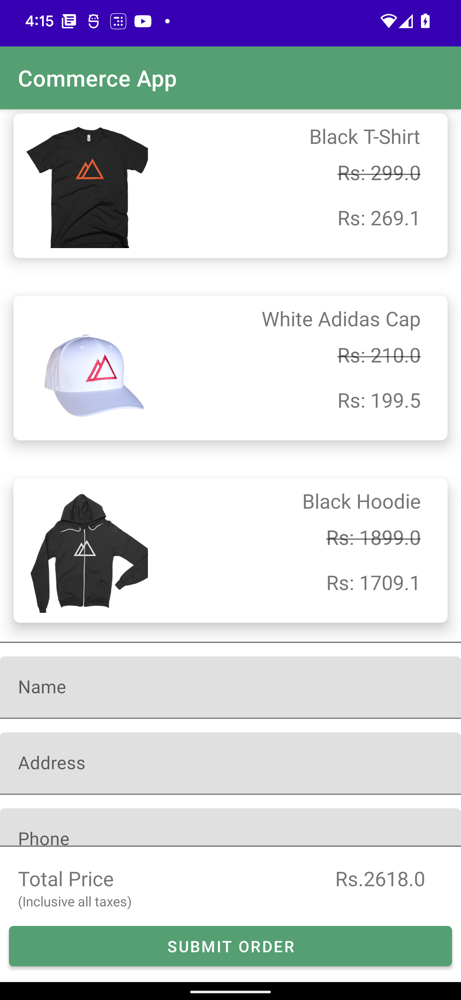
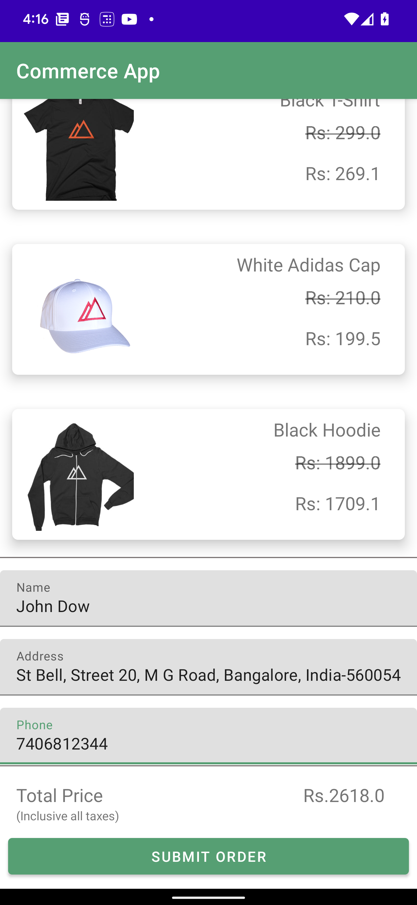
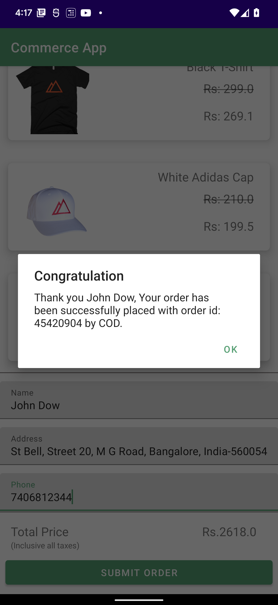

# Simple-Commerce-application

A)	 Simple Commerce application to showcase implementation of Clean Architecture and use of MVVM pattern with DataBinding principles.
 
You will be creating a simple commerce  application which allows user to view the store details and products, add products to the basket, and place an order. You will be using mock jSON API to perform all the requests. 
 
Note: Task is to create and access local jSON stored on your computer. Use Timer and API call to get the data.
Following jSon files needs to create and accessed:
•	StoreInfo
•	Products
•	OrderDone

The application consists of three screens:
 
1. Store details & products screen:
•	Fetch the store detail from /storeInfo endpoint and display them in the upper part of the screen.
•	Fetch the list of products from /products endpoint and display them in a list below store detail section.
•	Add an ability for the user to select product(s).
•	Skills Challenge: It is your choice on how you'd like to build this feature and the skills you'd like to demonstrate to us. You could allow:
•	Multiple quantity (e.g. + and - button on each product) and multiple products selection
•	Add a button at the bottom most of the screen to bring the user to the order summary screen.
2. Order summary screen:
•	Display the product(s) selected.
•	Display the total price.
•	Add one text box to allow user to fill in the delivery address.
•	Add a button at the bottom of the screen for the user to confirm order placement. Tapping on this button should display a loading indicator and make a request to post the data to /orderDone endpoint(store locally in jSOn). After the save successful request is completed, display a success screen.(You can post order details to local Json file and return true to mock order posted successfully) .Local copy should contain your order details.
3. Success screen:
•	Show a simple dismiss button that brings the user back to the first screen.

This consist of following:

•	Code/architecture supports scaling and reusability.
•	Write clean, readable and well-structured code.
•	Code is loosely coupled and uses an architecture similar to MVVM, CLEAN, VIPER, MVP, etc.
•	Follow recommended UI/UX principles.
•	Unit tests.
•	UI tests.
 
Product Screen

Checkout Screen

Checkout with address screen

Order placed screen
